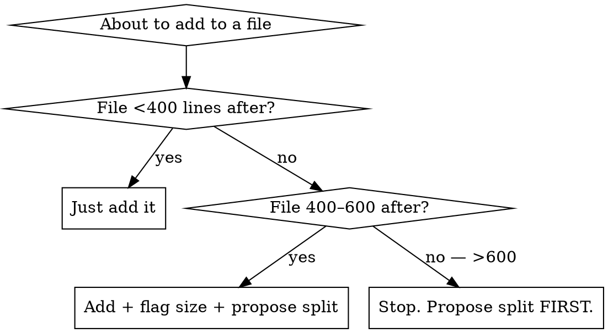

# Keeping Files Small

## Overview

Large files hide bugs. A 1200-line file is a god-class waiting to happen: navigation is slow, blast radius for any change is huge, merge conflicts cluster, and reviewers skim because there's too much to read. The honest agent default is "just add it where it fits, splitting is separate work" — but the next change keeps adding, and a year later you have `core.py` at 2000 lines.

**Core principle:** A file should have one job. When it grows past ~400 lines, that's a signal it's grown a second job that should live elsewhere.

## Thresholds (Rules of Thumb)

| Lines | Stance |
|---|---|
| <200 | Comfortable |
| 200–400 | Fine; watch the trend |
| 400–600 | Flag it — propose a split before adding more |
| 600+ | Don't add to it without splitting first |

These are rough. A 500-line file of cohesive logic is fine; a 200-line file with 4 unrelated concerns is worse. Apply judgment around the limit, don't blindly enforce.

## When To Use

- About to add a function/class to a file already >400 lines
- Your edit pushed a file past 600 lines
- Proposing where new code should live (greenfield decision)
- During the orientation pass when one file dwarfs the rest

## Decision Flow

## How to Propose a Split

Propose, don't unilaterally restructure:

1. **Identify the natural seams** — function clusters that share helpers, types, or a concept.
2. **Sketch the new files** — names + what moves into each.
3. **Show the user before doing it:**
   > "This file is 720 lines. I'd suggest splitting it into `<fileA>` (handles X) and `<fileB>` (handles Y). OK to do that before adding the feature?"
4. **If yes** — do the split as its own commit, no feature changes mixed in. Then add the new code in a follow-up commit.
5. **If no** — add to the existing file but flag the tech-debt explicitly in your reply.

## Common Mistakes

| Mistake | Fix |
|---|---|
| "Splitting is separate work, just ship the feature" | Files that grow forever become god-modules. Split now or never. |
| Unilaterally restructuring someone else's file | Propose first; let the user decide |
| Mixing the split + the new feature in one commit | Reviewers can't tell what changed. Split first, feature second. |
| Treating 400 lines as a hard rule | It's a signal, not a wall. Judge cohesion too. |
| Only flagging when files hit 1500+ | By 1500 it's already a god-module. Flag at 400, refuse at 600. |

## Red Flags — STOP

- About to add 50+ lines to a file already 500+ lines without raising the size question
- "I'll flag the tech debt and move on" — flagging is not enough when YOU pushed it past the threshold
- File has 20+ unrelated exports and you're adding #21
- Your reasoning is "splitting is risky / a side quest" — that's the rationalization this skill exists to overcome
